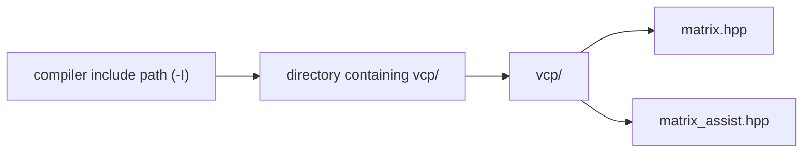
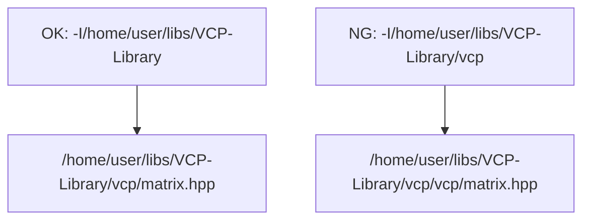

# Installation

VCP Library はヘッダ中心のライブラリです。基本的なインストールは、
`vcp/` ディレクトリを利用したい場所に置き、コンパイル時の include path に
`vcp/` を含むディレクトリを指定するだけです。

`vcp/` ディレクトリそのものを include path に指定しない点に注意してください。

## 基本の考え方

VCP のヘッダは次のように include します。

```cpp
#include <vcp/matrix.hpp>
#include <vcp/matrix_assist.hpp>
```

`matrix.hpp` は `vcp::matrix` 本体のヘッダです。`matrix_assist.hpp` は
行列の利用でよく使う補助機能をまとめて読み込むヘッダで、型変換や
ファイル入出力などを使う場合にも利用します。

そのため、コンパイラには `vcp/` の中ではなく、`vcp/` が置かれている
ディレクトリを渡します。



## 正しい配置例

例えば次のように配置したとします。

```text
/home/user/libs/VCP-Library/
└── vcp/
    ├── matrix.hpp
    ├── matrix_assist.hpp
    ├── mats.hpp
    └── ...
```

この場合、include path に指定するのは
`/home/user/libs/VCP-Library` です。

```bash
g++ -std=c++11 -I/home/user/libs/VCP-Library example.cpp
```

`#include <vcp/matrix.hpp>` に対して、コンパイラは次のファイルを探します。

```text
/home/user/libs/VCP-Library/vcp/matrix.hpp
```

## 間違いやすい例

次のように `vcp/` ディレクトリそのものを include path に指定しないでください。

```bash
g++ -std=c++11 -I/home/user/libs/VCP-Library/vcp example.cpp
```

この指定だと、`#include <vcp/matrix.hpp>` に対してコンパイラは次を探します。

```text
/home/user/libs/VCP-Library/vcp/vcp/matrix.hpp
```

つまり `vcp/` が二重になり、ヘッダを見つけられません。



## kv ライブラリを使う場合

区間演算や高精度計算を使う場合は、VCP Library とは別に kv ライブラリを
取得してください。kv のヘッダは次のように include します。

```cpp
#include <kv/interval.hpp>
#include <kv/rdouble.hpp>
```

そのため、kv についても `kv/` ディレクトリそのものではなく、
`kv/` が置かれているディレクトリを include path に指定します。

配置例:

```text
/home/user/libs/
├── VCP-Library/
│   └── vcp/
│       ├── matrix.hpp
│       └── ...
└── kv-library/
    └── kv/
        ├── interval.hpp
        ├── rdouble.hpp
        └── ...
```

この場合のコンパイル例:

```bash
g++ -std=c++11 -I/home/user/libs/VCP-Library -I/home/user/libs/kv-library example.cpp
```

コンパイラから見える必要があるファイルは次の 2 つです。

```text
/home/user/libs/VCP-Library/vcp/matrix.hpp
/home/user/libs/kv-library/kv/interval.hpp
```

## リポジトリ内のサンプルをコンパイルする場合

このリポジトリの `test_matrix/` などでサンプルをコンパイルする場合、
1 つ上のディレクトリが `vcp/` を含んでいます。

```text
VCP-Library/
├── vcp/
└── test_matrix/
    └── test_matrix.cpp
```

そのため、`test_matrix/` の中からコンパイルする例は次のようになります。

```bash
cd test_matrix
g++ -std=c++11 -I.. test_matrix.cpp
```

ここで `..` は `vcp/` を含む `VCP-Library/` を指します。

## 外部ライブラリが必要な場合

通常の `vcp::matrix<double>` だけなら、VCP のヘッダを配置して include path を
指定すれば利用できます。

一方、選択する policy やスカラー型によっては、追加の外部ライブラリが必要です。

| 用途 | 追加で必要なもの |
| --- | --- |
| 区間演算 | kv ライブラリ |
| `kv::mpfr` | MPFR |
| `vcp::pdblas`, `vcp::pidblas` | BLAS/LAPACK または Intel MKL |
| OpenMP を使うビルド | OpenMP 対応コンパイラとリンクオプション |

## 推奨する基本パッケージ

VCP Library 本体はヘッダを配置するだけで利用できますが、実際の数値計算では
開発環境、Boost、GMP、MPFR を入れておくと便利です。

Ubuntu の例:

```bash
sudo apt install build-essential libboost-all-dev libgmp-dev libmpfr-dev
```

Rocky Linux などの Red Hat 系 Linux の例:

```bash
sudo dnf groupinstall "Development Tools" -y
sudo dnf install boost-devel -y
sudo dnf install gmp-devel -y
sudo dnf install mpfr-devel -y
```

BLAS/LAPACK、Intel MKL、OpenBLAS、OpenMP の設定例は
[build.md](build.md) を参照してください。
