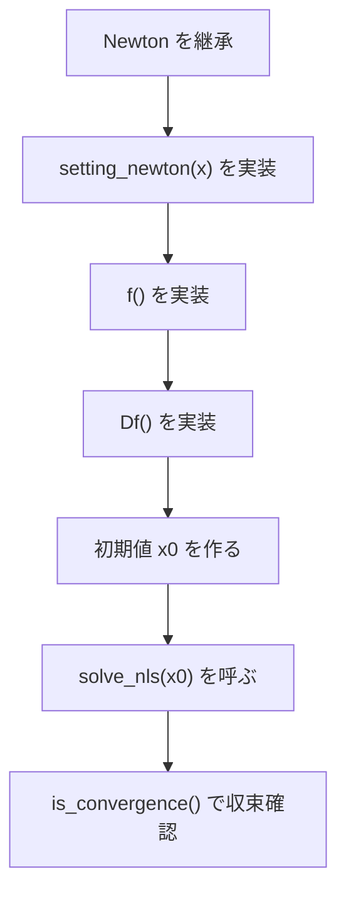

# Newton Solver Guide

この文書では、`vcp/newton.hpp` の使い方を説明します。

`vcp::Newton<T, Policy>` は、非線形方程式

```text
F(x) = 0
```

を Newton 法で解くための基底クラスです。利用者はこのクラスを継承し、
現在の近似解から残差 `f()` とヤコビ行列 `Df()` を作る処理を書きます。

## 基本の流れ

`vcp::Newton<T, Policy>` を使う手順は次の通りです。



オーバーライドする主な関数:

| 関数 | 役割 |
| --- | --- |
| `setting_newton(x)` | 現在の近似解 `x` を受け取り、`f()` と `Df()` が使う内部状態を更新する |
| `f()` | 現在の近似解における残差ベクトル `F(x)` を返す |
| `Df()` | 現在の近似解におけるヤコビ行列 `DF(x)` を返す |

`solve_nls(x0)` は、内部で次の形の線形方程式を解きます。

```text
DF(x_k) delta_k = F(x_k)
x_{k+1} = x_k - delta_k
```

収束判定は、補正量の相対的な大きさを使います。

```text
max(abs(delta_k)) / max(abs(x_k)) <= newton_tol
```

## 必要なヘッダ

利用する matrix policy を先に include し、その後で `matrix.hpp` と
`newton.hpp` を include します。

BLAS/LAPACK を使う近似計算の例:

```cpp
#include <cmath>
#include <iostream>

#include <vcp/pdblas.hpp>
#include <vcp/matrix.hpp>
#include <vcp/newton.hpp>
```

汎用 policy を使う場合:

```cpp
#include <vcp/matrix.hpp>
#include <vcp/newton.hpp>
```

## 最小例

次の例は、1変数方程式

```text
x^2 - 2 = 0
```

を Newton 法で解きます。`test_PDE/test_newton1.cpp` がこの形の基本例です。

```cpp
#include <cmath>
#include <iostream>

#include <vcp/pdblas.hpp>
#include <vcp/matrix.hpp>
#include <vcp/newton.hpp>

template <typename T, typename Policy>
struct Sqrt2Newton : public vcp::Newton<T, Policy> {
    vcp::matrix<T, Policy> x;

    void setting_newton(vcp::matrix<T, Policy>& xx) override {
        x = xx;
    }

    vcp::matrix<T, Policy> f() override {
        return pow(x, 2) - 2;
    }

    vcp::matrix<T, Policy> Df() override {
        return 2 * x;
    }
};

int main() {
    vcp::matrix<double, vcp::pdblas> x;
    x.zeros(1);
    x(0) = 1.4;

    Sqrt2Newton<double, vcp::pdblas> solver;
    x = solver.solve_nls(x);

    std::cout << x << std::endl;
    std::cout << "convergence: " << solver.is_convergence() << std::endl;
}
```

`f()` は 1 成分の残差ベクトル、`Df()` は 1 x 1 のヤコビ行列として扱われます。
VCP の matrix 演算により、`pow(x, 2) - 2` や `2 * x` のように書けます。

## 収束判定の設定

デフォルトの収束判定は次です。

```cpp
newton_tol = 4 * std::numeric_limits<T>::epsilon();
```

許容値を変更する場合は、`setting_newton_tol(n)` を使います。

```cpp
solver.setting_newton_tol(100);
```

この場合、

```text
newton_tol = 100 * std::numeric_limits<T>::epsilon()
```

になります。

`solve_nls()` の後は `is_convergence()` で収束したか確認できます。

```cpp
auto x = solver.solve_nls(x0);

if (!solver.is_convergence()) {
    std::cout << "Newton iteration did not converge." << std::endl;
}
```

最大反復回数はデフォルトで 100 回です。`newton_max_iteration` は
派生クラスから参照できるため、必要なら派生クラスのコンストラクタで
変更できます。

```cpp
template <typename T, typename Policy>
struct MyNewton : public vcp::Newton<T, Policy> {
    MyNewton() {
        this->newton_max_iteration = 200;
    }

    // setting_newton, f, Df を実装する
};
```

反復中の表示を変えたい、または止めたい場合は、`disp_continue()` と
`disp_convergence()` をオーバーライドします。

```cpp
void disp_continue() override {}

void disp_convergence() override {
    std::cout << "Newton converged." << std::endl;
}
```

## PDE での使い方

PDE の例では、近似解ベクトルを基底関数の係数として扱い、`setting_newton()` で
基底生成器に現在の係数を渡します。その後、`f()` で離散化された非線形方程式の
残差、`Df()` でそのヤコビ行列を返します。

例えば `test_PDE/test_newton2_Emden.cpp` では、Legendre 基底を使い、
次のような構成になっています。

```cpp
void setting_newton(vcp::matrix<T, Policy>& uh) override {
    Generator.setting_uh(uh);
    u = uh;
}

vcp::matrix<T, Policy> f() override {
    auto uh2phi = Generator.uhphi(2);
    return DL * u - uh2phi;
}

vcp::matrix<T, Policy> Df() override {
    auto uhphiphi = Generator.uhphiphi(1);
    return DL - 2 * uhphiphi;
}
```

このように、`Newton` 自体は PDE 専用ではなく、`matrix` で表された残差と
ヤコビ行列を返せる問題なら同じ形で利用できます。

## 代表的なサンプル

| ファイル | 内容 |
| --- | --- |
| `test_PDE/test_newton1.cpp` | `x^2 - 2 = 0` を解く最小例 |
| `test_PDE/test_newton2_Emden.cpp` | Legendre 基底を使う Emden 問題の Newton 法 |
| `test_PDE/test_1d_Neumann_Gray_Scott.cpp` | Fourier cosine basis を使う Gray-Scott 型の例 |
| `test_PDE/test_Lotka_Volterra2_NOLTA2021.cpp` | 論文に紐づく Lotka-Volterra 型の例 |

## 注意点

- `f()` の戻り値は列ベクトル、`Df()` の戻り値は正方行列になるようにします。
- `Df()` が特異または悪条件の場合、内部の線形方程式 `lss(Df(), f())` が失敗することがあります。
- 初期値が解から遠い場合、Newton 法は収束しないことがあります。
- `solve_nls()` は収束しなかった場合でも最後の反復値を返します。必ず `is_convergence()` を確認してください。
- 収束判定では `max(abs(x_k))` で割るため、初期値や反復中の解が零ベクトルに近い問題では注意が必要です。
